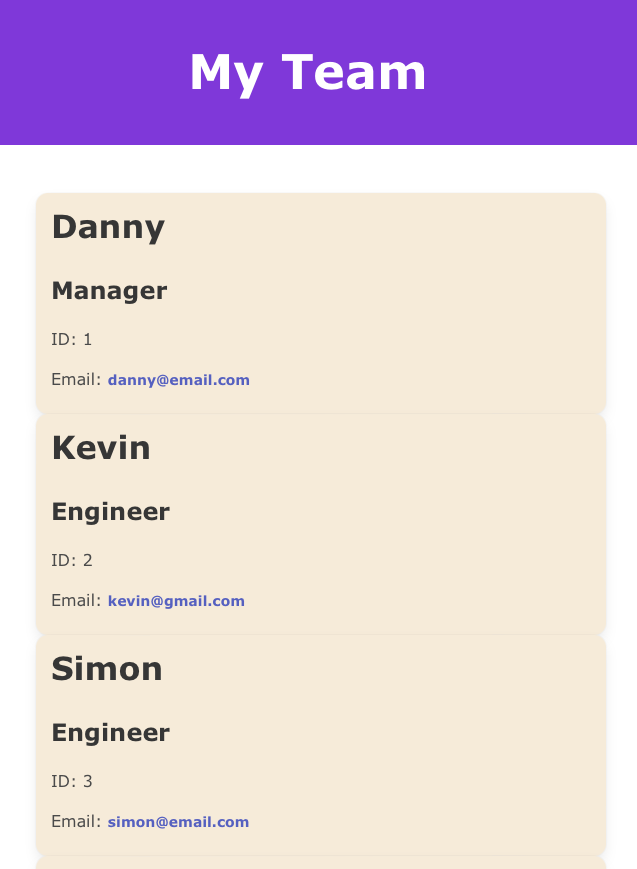

# Team Profile Generator

This is a **team profile generator** that creates a roster of your team.

## Table of Contents

- [Background](#background)
- [Install](#install)
- [Usage](#usage)
- [Screenshot](#screenshot)
- [Maintainers](#maintainers)
- [Contributing](#contributing)
- [Contributors](#contributors)
- [License](#license)

## Background

*To apply lessons from object oriented programming,* we were instructed to create an app that takes in information about employees and generates a roster of them online, incorporating the inputs. The package also comes with a handful of tests that pass.

## Install/Link to Webpage 🔗 

Check out the link to the video walkthrough:

https://youtu.be/SP9Zsa2a6Bg

And here's a link to the repo:

https://github.com/dbedrossian/Mod10_Team-Profile-Generator

## Usage

This is being used as an assignment project, but could easily be used in real life in backend for any kind of HTML roster generating app.

## Screenshot

## Maintainers

[@Danny Bedrossian](https://github.com/dbedrossian).

## Contributing

Feel free to dive in! [Open an issue](https://github.com/dbedrossian/standard-readme/issues/new) or submit PRs.

## Contributors

Thanks for some guidance from tutor Sachin.

## License

Open